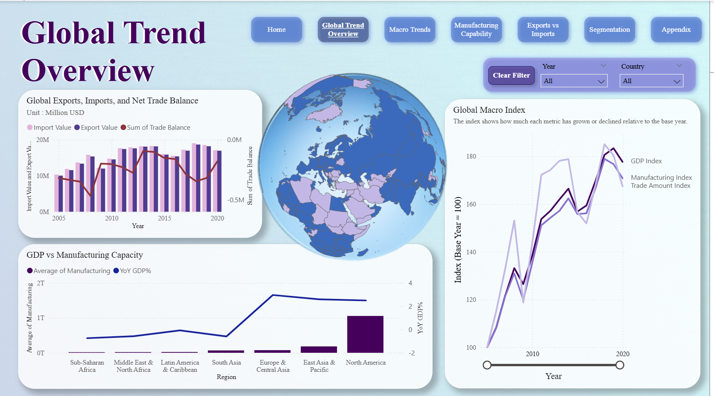
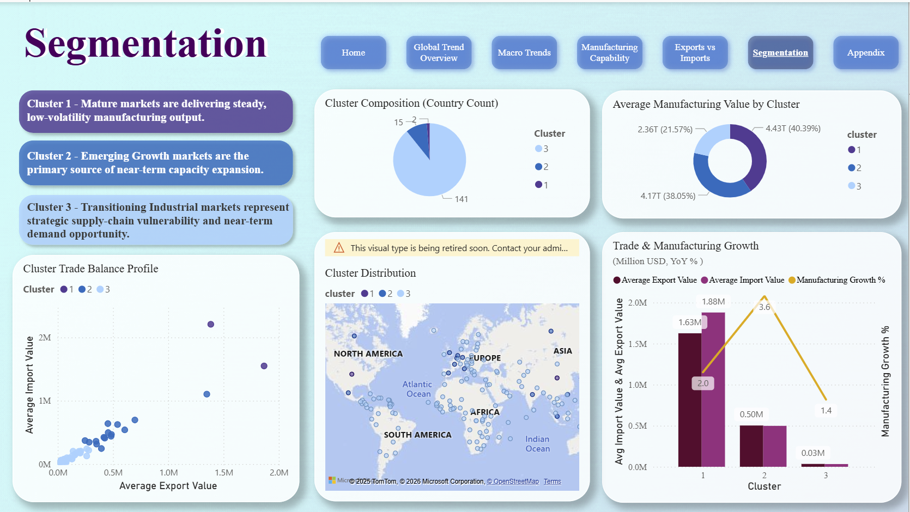

# Global Market Analysis & Trade Segmentation

This project analyses global manufacturing output, trade flows, and GDP patterns
to identify international market opportunities and structural trade differences
across countries.

The project combines **interactive Power BI dashboards** with **R-based k-means
segmentation** to support data-driven market expansion and entry strategy decisions.

---

## Dashboard Preview (no download required)



### Interactive features




### Short interactive demo


> The full interactive Power BI dashboard is available in  
> `powerbi/global_market_dashboard.pbix` (tracked via Git LFS).  
> Power BI Desktop is required to open the `.pbix` file.

---

## Analytical Approach

1. **Data collection & preparation**
   - Collected international datasets covering manufacturing output, trade balance,
     and GDP indicators
   - Cleaned, reshaped, and consolidated data using R and Power BI
   - Created analytical fields and measures using DAX

2. **Segmentation analysis (R)**
   - Applied **k-means clustering** in R to segment countries based on:
     - Manufacturing scale
     - Trade balance characteristics
     - Economic indicators
   - Evaluated cluster patterns and economic meaning
   - Exported cluster results for integration with BI visuals

3. **Visual analytics & interpretation**
   - Integrated segmentation results back into Power BI
   - Designed interactive dashboards with:
     - Slicers and cross-filtering
     - Comparative cluster views
     - Drill-through and tooltip interactions
   - Interpreted results to support market prioritisation and entry strategy insights

---

## Key Insights

- Countries can be segmented into distinct groups based on manufacturing capacity and trade balance  
- Manufacturing scale alone does not determine market attractiveness or trade advantage  
- Market entry strategies should differ by structural position rather than applying a uniform approach across countries

---

## Strategic Implications (Summary)

The segmentation analysis suggests that international expansion strategies should vary by market structure rather than applying a uniform approach:

- **Mature markets:** Emphasise brand differentiation and supply chain optimisation  
- **Emerging growth markets:** Prioritise speed-to-market through local assembly or partnerships  
- **Exploratory markets:** Use cross-border e-commerce to test demand before committing resources  

Detailed cluster-level strategies and examples are documented in [`analysis/strategic_implications.md`](analysis/strategic_implications.md).

---

## Repository Structure

```text
powerbi/        # Power BI dashboard (.pbix, Git LFS tracked)
analysis/       # R scripts for clustering and segmentation
data/           # Cleaned and merged datasets used for analysis
presentation/   # Project presentation slides
images/         # Dashboard screenshots and GIF demo
```

---

## Tools & Skills Demonstrated

- Power BI: data modelling, DAX, interactive dashboards
- R: k-means clustering, segmentation analysis
- Data preparation: data cleaning, reshaping, integration
- Business analytics: translating analytical results into strategic insights

---

## Notes

- This project was completed as part of an academic team assignment, with individual
contributions focused on data preparation, segmentation analysis, and dashboard design
- Business analytics: translating analytical results into strategic insights
